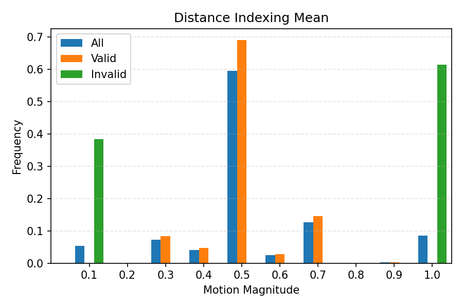
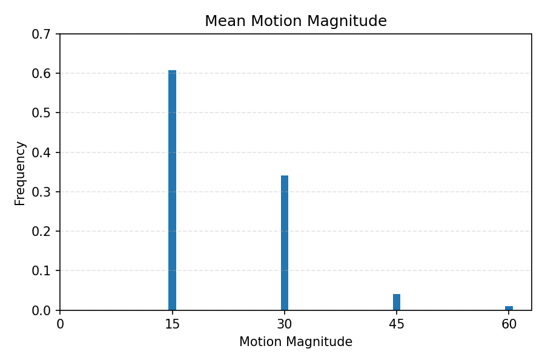

# Steps for preparing datasets
1. Change the path in `dataset_config.py` such as 
``` python
MINOR_DATASET_CONFIGS = {
    "name": "AnimeFantasyRPG_3",
    "root_dir": "/datasets/VFI/datasets/AnimeFantasyRPG",
    "records": {
        "AnimeFantasyRPG_3_60": {
            "main_indices": ["0", "1"],
            "difficulties": ["Easy", "Medium"],
            "sub_index": ["1", "1"],
            "fps": [30, 60],
            "max_index": [400, 800],  # depending on fps
        }
    }
}
```
2. Perform preprocessing with `dataset_preprocess.py`
``` python
# Control flags to perform several preprocessing steps
    REMOVE_IDENTICAL = False                # initial raw frame index generation with identical images removed
    CHECK_IDENTICAL_CROSS_FPS = False       # check identical images between fps 30 and fps 60
    MANUAL_LABELING = False                 # manual labeling based on Medium difficulty and Easy difficulty
    MERGE_DATASETS = False                  # merge Easy and Medium difficulties into one dataframe with global validity
    RAW_SEQUENCE = False                    # generate sequence from 0 to MAX INDEX with valid flag
    LINEARITY_CHECK = True                  # check motion linearity between 2 to 0 and 1 to 0 flow by distance indexing 
```

3. Perform dataset analysis with `dataset_stats.py`
* distance indexing mean: 70% dataset around (0.45 - 0.55), bias value can be control

* motion magnitude freq: 60% frames are having < 15 pixels


4. Data loader for further inference or training with `dataset_loader.py`
``` python
# inference_ifrnet.py
from datasets.dataset_loader import VFIDataset
from datasets.dataset_config import STAIR_DATASET_CONFIG, iter_dataset_configs

ROOT_DIR = "./datasets/data/"
MODEL_PATH = "./models/IFRNet/checkpoints/IFRNet/IFRNet_Vimeo90K.pth"
OUTPUT_DIR = "./output/IFRNet/"
DATASET = STAIR_DATASET_CONFIG

for cfg in iter_dataset_configs(DATASET):
    if cfg.fps != 60:
        continue

    df = pd.read_csv(f"{ROOT_DIR}/{cfg.record_name}_preprocessed/{cfg.mode_index}_raw_sequence_frame_index.csv")

    dataset = VFIDataset(
        df=df,
        root_dir=DATASET["root_dir"],
        record=cfg.record,
        mode=cfg.mode_path,
        input_fps=30,
    )

    with tqdm(range(len(dataset))) as pbar:
        for i in pbar:
            sample = dataset[i]
            input = sample["input"]
            gt = sample["ground_truth"]

            img0_path = input["colorNoScreenUI"][0]
            img1_path = input["colorNoScreenUI"][1]
            imgGT_path = gt["colorNoScreenUI"]
            bmv_path = gt["backwardVel_Depth"]
            fmv_path = gt["forwardVel_Depth"]

            ...
```